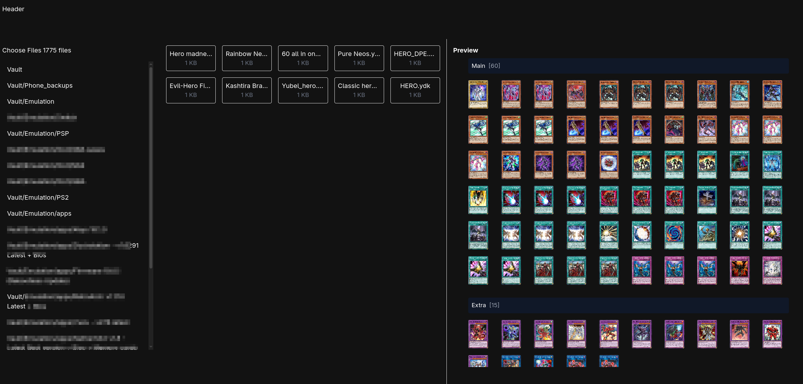

# 📂 Ultimate Folder

Ultimate Folder is a **browser-based folder explorer** built with **SvelteKit**.  
It lets you load an entire folder from your local machine and:
- 🔍 Browse files and folders
- 📂 View files in a responsive grid
- 🖼️ Preview different file types directly in the browser

No server upload, **everything stays local**. Ideal for fast local browsing and previews.

---

## ✨ Features

- 📂 Load and browse local folders (via `webkitdirectory` input)
- 📁 View files grouped by folder
- 🖼️ Preview supported file types:
  - Images (`.png`, `.jpg`, `.gif`, `.webp`)
  - Videos (`.mp4`, `.webm`, `.ogg`)
  - Text/Code files (`.txt`, `.md`, `.js`, `.py`, etc.)
  - Custom file types like `.ydk`, `.gba`, `.iso` with special components
- 🖱️ Responsive grid view of files
- 🔒 Files are handled **entirely in the browser** (safe and local)

---

## 🚀 TODO Roadmap (Next Features)

### 🔎 Search & Filter
- [ ] Search files by name 🔍
- [ ] Filter by file type (e.g., show only images / only videos)

### 📊 New File Previews
- [ ] **CSV preview** (use [PapaParse](https://www.papaparse.com/) or [csv-parser](https://github.com/mafintosh/csv-parser))
- [ ] **Excel (`.xlsx`) preview** (use [SheetJS](https://sheetjs.com/))
- [ ] **Word Docs (`.docx`) preview** (use [mammoth.js](https://github.com/mwilliamson/mammoth.js))
- [ ] **PowerPoint (`.pptx`) preview** (use [PptxGenJS](https://gitbrent.github.io/PptxGenJS/))
- [ ] **MP3 / Audio preview** (native `<audio>` player)
- [ ] **PDF preview** (use [PDF.js](https://mozilla.github.io/pdf.js/))

### 🖥️ UI/UX Enhancements
- [ ] Show file size and modified date
- [ ] Sort files (by name, size, date)
- [ ] Show breadcrumbs (`Root / Folder / Subfolder`)
- [ ] Allow collapsing/expanding folder tree
- [ ] Go back and forth in files and display 1 level only

## 🛠️ Tech Stack

- [SvelteKit](https://kit.svelte.dev/) (frontend framework)
- Tailwind CSS (responsive styling)
- File APIs (`FileReader`, `webkitdirectory`) for local file handling
- All file parsing is done **client-side** (privacy safe)

---

## 🖼️ Supported File Types (Current)

| Type        | Extensions                               |
|-------------|-------------------------------------------|
| 📄 Code/Text| `.txt`, `.md`, `.js`, `.py`, `.json`, etc. |
| 🖼️ Image    | `.png`, `.jpg`, `.jpeg`, `.gif`, `.webp`   |
| 🎥 Video    | `.mp4`, `.webm`, `.ogg`                   |
| 🎮 Custom   | `.ydk`, `.gba`, `.iso`                    |

---

## 📂 How It Works
- Uses `input type="file" webkitdirectory` to select entire folders
- Uses **relative paths** (`webkitRelativePath`) to reconstruct folders and files
- Files are displayed in a grid and can be previewed directly
- Uses **FileReader** to read file content for previews (text, images, video)

---

## 💡 Name Idea Alternatives
- Ultimate Folder (✅ current)
- Ultimate Folder Explorer
- Ultimate Files
- Local Folder Viewer
- FileGrid

---

## 📸 Screenshot

---

## 📝 License

MIT License.  
This project is open for contributions — feel free to fork and add new file previews!
